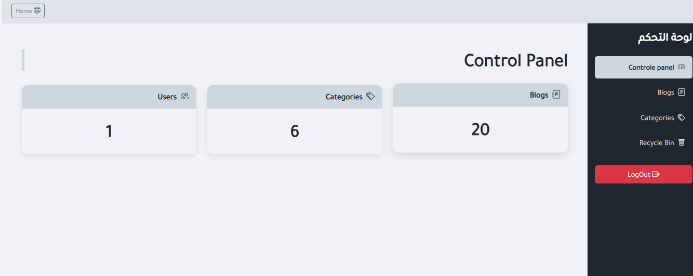
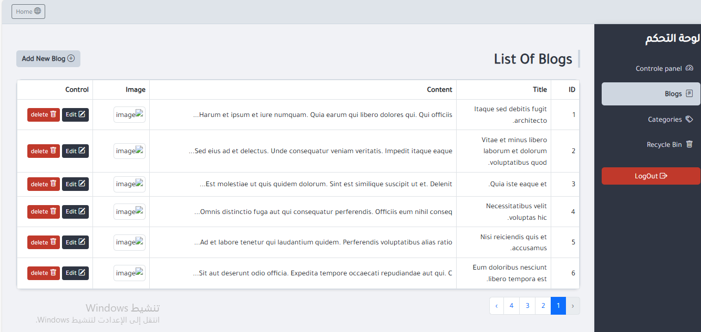
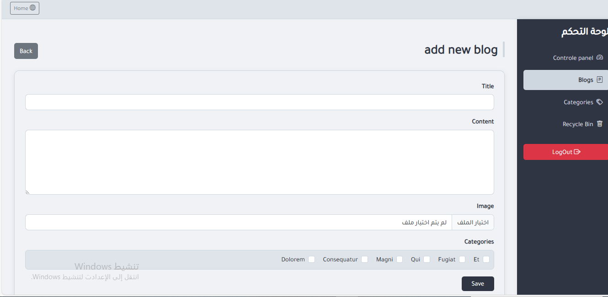
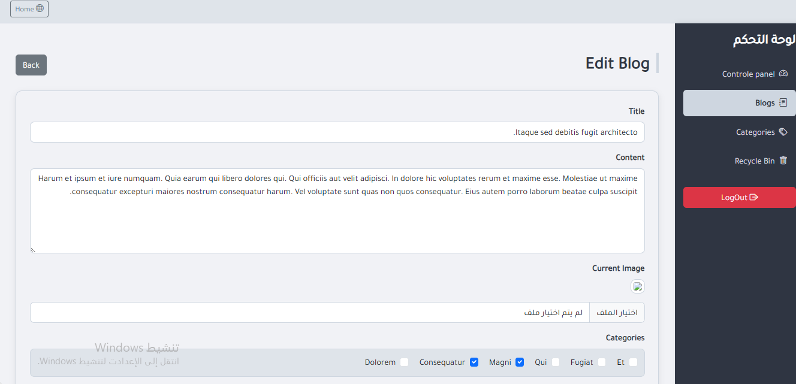
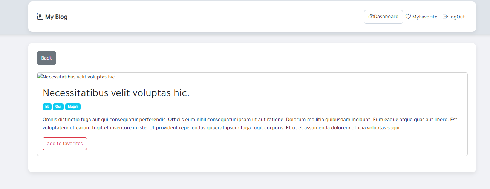
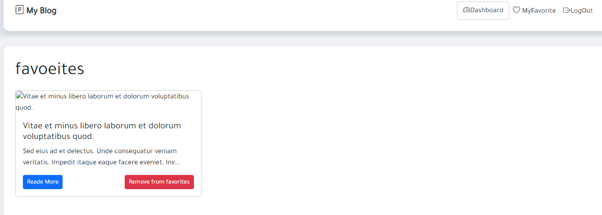
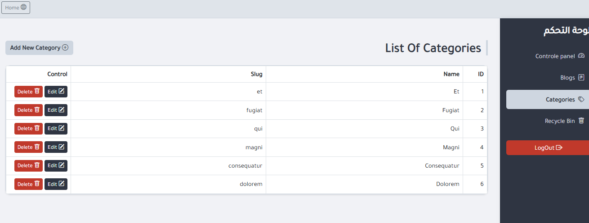
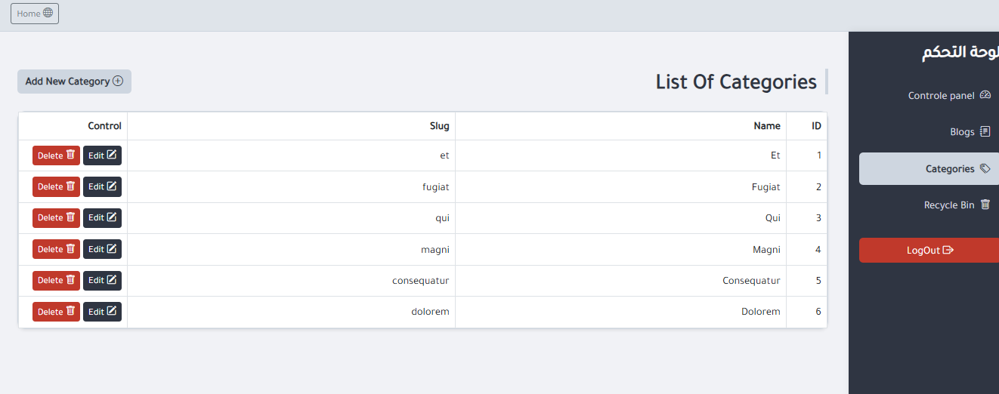
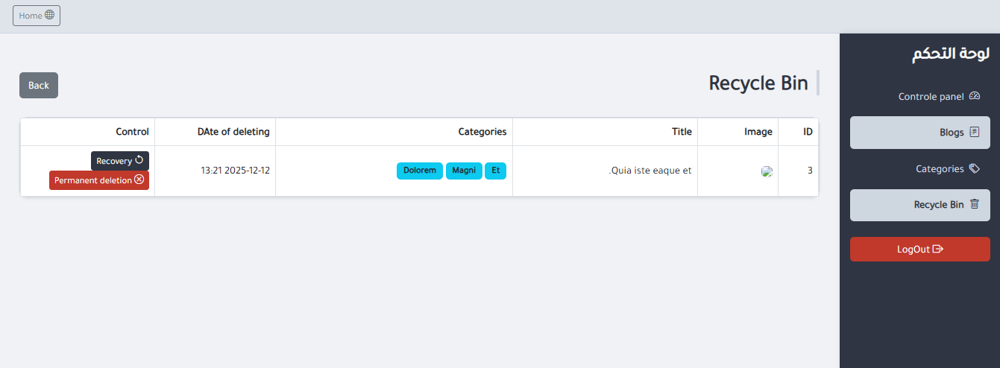

# Blog Project – Laravel

A full-featured **Blog Application** built with **Laravel**, supporting two roles: **Admin** and **User**.

The project includes authentication, blog management, categories, favorites, and an admin dashboard with advanced CRUD and restore/delete functionalities.

---

## Features

### **User Features**
- View all blog posts
- View single blog details
- Add blogs to favorites
- Authentication required (Login/Register)

### **Admin Features**
- Full CRUD operations for:
  - Blogs
  - Categories
- Soft delete & restore functionality
- Permanent delete option
- Admin Dashboard showing:
  - Total blogs
  - Total categories
  - Total users
- Manage all content from a centralized dashboard

---

##  Prerequisites

- Laravel **12**
- **MySQL**
- **Node.js & npm**
- **Blade Templates**
- **Bootstrap** and **CSS**
- **Laravel Breeze** for authentication

---

##  Installation

### 1. Clone the repository

git clone https://github.com/Ebla-a/Blog.git

### 2. Install dependencies
- composer install
- npm install
###3 . Set up the environment variables
Copy the .env.example file to .env and update the database credentials and other necessary configuration

 ### 4. Generate application key
 php artisan key:generate

### 5. Run migrations and seed the database
php artisan migrate --seed

### 6. Build front-end assets
npm run dev
### 7. Start the development server
php artisan serve
The application will be available at: http://localhost:8000

## Database Seeding

This project includes factories and seeders to generate sample data for testing

To seed the database run:

php artisan migrate --seed

### Authentication
The **admin** dashboard provides an overview of the system:

- Total Blogs
- Total Categories
- Total Users

Quick access to CRUD operations:
Manage soft-deleted items (restore or permanently delete)

##  Screenshots

### Admin Dashboard

---

##  Blogs Management

###  List Blogs

###  Add Blog

###  Edit Blog

###  Single Blog Page

###  Favorite Page

---

##  Categories Management

###  List Categories

### Add Category

###  Edit Category

---

##  Trash / Recycle Bin

 

